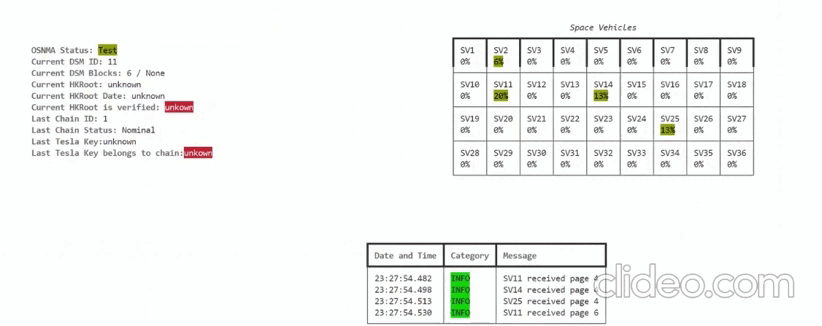

<p align="center">
  <a href="" rel="noopener">
 </a>
</p>

<h3 align="center">OSNMA for Galileo Mass-Market GNSS Receivers<sup>1</sup></h3>

<div align="center">

[]()

[](/LICENSE)


</div>

---


[OSNMA](https://gssc.esa.int/navipedia/index.php/Galileo_Open_Service_Navigation_Message_Authentication) is one of Europe's [Galileo](https://www.euspa.europa.eu/european-space/galileo/What-Galileo) coolest features: the authentication of GNSS Data. Devices such as Drones rely on having accurate not spoofed data, and as rapid as its market grows, as rapid grows the need of having anti-spoofing mechanisms.
You can find that there are already spoofing detection mechanisms,  but there is still no mechanism that can ensure GNSS data has not been altered for cheap mass-market standalone GNSS Receivers that does not rely on on-line authentication.
OSNMA is the unique Galieo GNSS feature that allows any receiver to make sure the data it is receiving has not been altered. OSNMA is expected to be one extra layer of security that can work together with other anti-spoofing/anti-jamming techniques.

This library provides any user the means to implement OSNMA **in mass market receivers** that can be bought for really cheap -[e.g., this NEO-M9N](https://www.mikroe.com/gnss-7-click). Specifically, this library has been developed based on Ublox Receivers, altough its core can work for any GNSS receivers that can get Galileo I/NAV Pages.

*Note: the work in this library is not related to ublox as a company, we only use their products as they are well-documented and cost-effective. UBLOX is a trademark of u-blox Holding AG.*
## 📚 Applicable Documentation <a name = "about"></a>

The following documents have been used to prepare this library, although you can find related info in our [/docs/](https://github.com/astromarc/osnmaPython/tree/master/docs) section.

For GALILEO's documentation, please find last issues on [GSC site](https://www.gsc-europa.eu/electronic-library/programme-reference-documents).

For UBLOX documentation, please find updated documents on their [webpage](https://www.u-blox.com/en/product-resources)

```
[RD-1] The European GNSS (Galileo) Open Service Navigation Message Authentication (OSNMA) User Interface Control Document for the Test Phase 
Short title: OSNMA User ICD for the Test Phase
Issue: 1.0
```
```
[RD-2]The European GNSS (Galileo) Open Service Signal-In-Space Interface Control Document
Short Title: OS SIS ICD
Issue: 2.0
```
```
[RD-3] NEO-M9N - Standard precision GNSS module - Integration manual
Short Title: NEO-M9N Integration Manual
Reference: UBX-19014286
Issue: R06
```
```
[RD-4]	The European GNSS (Galileo) Open Service Navigation Message Authentication
(OSNMA) Receiver Guidelines for the Test Phase
Short Title: OSNMA Receiver Guidelines for the Test Phase
Reference: N/A
Issue: 1.0
```
```
[RD-5]	The European GNSS (Galileo) Open Service Signal-In-Space Interface Control Document
Short title: OS SIS ICD
Reference: N/A
Issue: 2.0
```
```
[RD-6]	GNSS Data Processing Volume I: Fundamentals and Algorithms
Short title: OS SIS ICD
Reference: ESA TM-23
Available online on https://gssc.esa.int/navipedia/GNSS_Book/ESA_GNSS-Book_TM-23_Vol_I.pdf
```


## 🏁 Getting Started <a name = "getting_started"></a>

Make sure to download the word/pdf document in our ./docs folder and follow the Software Operations Manual Section!


### Prerequisites

This could should work at for any python3. It has been tested for python 3.10.

The library uses several in-build librarys but the following external are needed:

1. pyserial:
```
pip install pySerial  
```
2. pyubx2:
```
pip install pyubx2 
```
3. ecdsa:
```
pip install ecdsa 
```
4. bitarray:
```
pip install bitarray 
```
5. rich:
```
pip install rich 
```
### Configuring the uBlox Receiver

Make sure to configure the uBlox receiver to ONLY output the SFBRX and Galileo from Ublox! See our Sofware Manual in /docs

### Configuration

From mainHMI_Laptop.py, configure the parameters as indicated in the code, editing it with your favorite editor.
This includes if you want to save the Received Data as well as the naming for the logs generated.

### Launch

Execute the python script "mainHMI.py" and enjoy! You should be seeing logs and updates as per the following image:



## ✍️ Authors <a name = "authors"></a>

- [@jametller](https://github.com/jametller) - GNSS & Cryptography Expert
- [@astromarc](https://github.com/astromarc) - GNSS Engineer


* * *
<sup>1</sup>Cover image is property of [EUSPA](https://www.euspa.europa.eu/)
